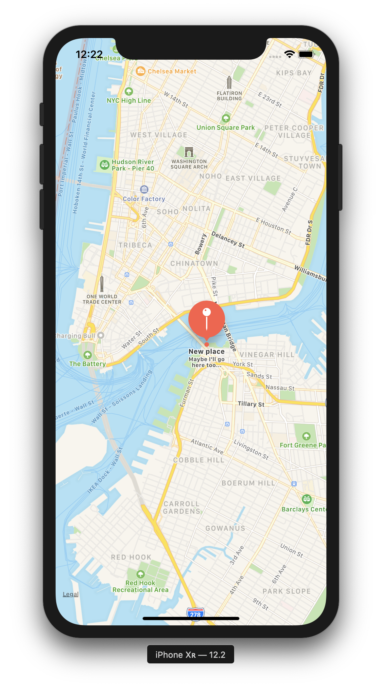

# 📲 Adding User Annotations To Maps
-
[](https://opensource.org/licenses/MIT) [](https://GitHub.com/Naereen/StrapDown.js/graphs/contributors/) [](https://github.com/ellerbrock/open-source-badges/) [](https://saythanks.io/to/kennethreitz)

[](https://GitHub.com/Naereen/)

[](https://forthebadge.com)



```swift
/     // To allow user add annotation to the map -> recognizing a long press in the apps
        // adding colon after longpress makes sure that info get sent to gestureRecognizer and we can recieve it -> changed to #selector(ViewController.longpress(gestureRecognizer:))
        let uilpgr = UILongPressGestureRecognizer(target: self, action: #selector(ViewController.longpress(gestureRecognizer:)))
            
        uilpgr.minimumPressDuration = 2 // in seconds
            
        map.addGestureRecognizer(uilpgr)
        
    }
    
    @objc func longpress(gestureRecognizer: UIGestureRecognizer) {
        
        let touchPoint = gestureRecognizer.location(in: self.map)
        
        let coordinate = map.convert(touchPoint, toCoordinateFrom: self.map)
        
        let annotation = MKPointAnnotation()
        
        annotation.coordinate = coordinate
        
        annotation.title = "New place"
        
        annotation.subtitle = "Maybe I'll go here too..."
        
        map.addAnnotation(annotation)
        
    }
    
}        
```